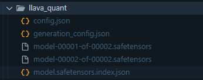

# Lab - Build LLAVA Chatbot backed by Ray Serve

# Prerequisite

You can choose to run on your local environment without even bother AWS, but if you want to run on EC2, here is the setup requirement:

- AMI `ami-0a0e5d9c7acc336f1`
- machine type `g4dn.xlarge` (comes with GPU)
- available space > `50GB`
- NVIDIA driver setup (refer to previous labs)

# Prepare Trained Model

create a folder called `ray_serve_lnext` , under which create a file `model_dl_quant.py` for downloading the pretrained model

```python
from transformers import (
	LlavaNextProcessor, 
	LlavaNextForConditionalGeneration, 
	BitsAndBytesConfig
)
import torch
from PIL import Image
import requests

import logging
import warnings

from constants import llava_next_template

logging.basicConfig(level=logging.INFO)
warnings.filterwarnings("ignore", category=DeprecationWarning) 

base_f = '#'*40
formatting = f'\n\n{base_f}\n\n'
quant = True

# specify how to quantize the model
quantization_config = BitsAndBytesConfig(
    load_in_4bit=True,
    bnb_4bit_quant_type="nf4",
    bnb_4bit_compute_dtype=torch.float16,
)
processor = LlavaNextProcessor.from_pretrained("llava-hf/llava-v1.6-mistral-7b-hf")

#otherwise a ValueError no template found is thrown with the latest transformers update
processor.chat_template = llava_next_template
if quant:
    #available on a a single consumer gpu, single node
    load_in_4bit=True
    torch_dtype=torch.float32
    attn_implementation=None

else:
    #requires multiple gpus
    load_in_4bit=False
    torch_dtype=torch.float16
    attn_implementation="flash_attention_2"
    quantization_config=None

model = LlavaNextForConditionalGeneration.from_pretrained(
	"llava-hf/llava-v1.6-mistral-7b-hf", 
	torch_dtype=torch_dtype, 
	quantization_config=quantization_config,
	attn_implementation=attn_implementation,
	low_cpu_mem_usage=True
) 

# save model to local dir
model.save_pretrained("llava_quant", from_pt=True) 
model = LlavaNextForConditionalGeneration.from_pretrained("llava_quant")
```

you need the following dependency in local env to run this script:

```bash
torch
ray[serve]
fastapi
transformers
starlette
bitsandbytes
accelerate
pillow
```

and run this script to save the pretrained model:

```bash
mkvirtualenv test -p python3.11
pip install -r requirements.txt
python model_dl_quant.py
```

<aside>
⚠️

note that this is a big model, so you may encounter disk space full error, the below commands will help you debug the space usage:

```bash
# show which mounting point is highly used:
df -k

# CD into the target folder, and show top occupied folder:
sudo du -aBM -d 1 . | sort -nr | head -20
```

</aside>

and you will see a new folder with trained model created at the current working directory:



# Create Ray Serve Application

create an `app.py` file:

```python
import torch
from transformers import (
	LlavaNextProcessor, 
	LlavaNextForConditionalGeneration, 
	BitsAndBytesConfig
)

from constants import llava_next_template
from starlette.requests import Request
from PIL import Image
import requests
import logging
import warnings
import ray
from ray import serve

logging.basicConfig(level=logging.INFO)
warnings.filterwarnings("ignore", category=DeprecationWarning) 
    
ray.init(address="auto", namespace="example")
# need to specify port number otherwise it will not correctly binded
serve.start(detached=True, http_options={"host": "0.0.0.0", "port": 8000})

@serve.deployment(
    ray_actor_options={
        "num_gpus": 1,
        "num_cpus": 4  # need to be less than available nodes
    }
)
class LNXT:
    def __init__(self):
        self.processor = LlavaNextProcessor.from_pretrained(
          "llava-hf/llava-v1.6-mistral-7b-hf"
        )
        self.processor.chat_template = llava_next_template
        self.model = LlavaNextForConditionalGeneration.from_pretrained(
            "llava_quant", 
						low_cpu_mem_usage=True
				)
            

    async def __call__(self, http_request: Request)  -> str:
        request = await http_request.json() 
        prompt, url = request["prompt"], request["url"]

        assert url is not None, 'please provide an image url!'                
        inputs = self.preprocess(prompt, url)
        assert torch.is_tensor(inputs['input_ids'])

        output = self.model.generate(**inputs, max_new_tokens=100)

        return self.processor.decode(output[0], skip_special_tokens=True)

    def eval(self, txt: str):
        encoded_text = self.tokenizer(
          txt, 
          return_tensors="pt", 
          padding=True, 
          truncation = True
        )
        generated_tokens = self.model.generate(
          **encoded_text,forced_bos_token_id=self.tokenizer.get_lang_id(
            self.trg_lang
          )
        )
        return self.tokenizer.batch_decode(
          generated_tokens, 
          skip_special_tokens=True
        )[0]
    
	  def preprocess(self, prompt, url):
				conversation = [
		        {
				        "role": "user",
				        "content": [
		                {"type": "text", "text": prompt},
		                {"type": "image"},
		            ],
		        },
        ]
        
        image = Image.open(requests.get(url, stream=True).raw)
        prompt = self.processor.apply_chat_template(
		        conversation, 
		        add_generation_prompt=True
        )
        inputs = self.processor(prompt, image, return_tensors="pt").to("cuda:0")

        return inputs
                    
app = LNXT.bind()
```

and it needs some constant template file `constants.py`

```python
llava_next_template = "{{ '[INST] ' }}{# Render all images first #}{{ '<image>\n' }}{# Render all text next #}{{ content['text'] }}{{' [/INST]' }}{{ ' ' + message['content'][0]['text'] + '<\\s> '}}{{ raise_exception('Only user and assistant roles are supported!') }}"
```

# Dockerize the Ray Application

build docker file `Dockerfile`

```docker
FROM rayproject/ray:latest-py311-gpu # very big image!
WORKDIR /home/ray

RUN pip3 install --upgrade pip

COPY requirements.txt requirements.txt
RUN pip install --upgrade pip
RUN pip install --no-cache-dir -r requirements.txt

#note that this is purely for speed of example deplyment
#baking a model in violates dockers no unecessary bloat at build paradigm
#we'll see the use of a networked store as a solution shortly!
COPY ./llava_quant /home/ray/llava_quant/
COPY app.py /home/ray/app.py
COPY constants.py /home/ray/constants.py

#servev
EXPOSE 8000
#dashboard
EXPOSE 8265

# Define the command to run when the container starts
# 1st start the dashboard and then start the ray serve application
CMD ["sh", "-c", "ray start --head --dashboard-host 0.0.0.0 && serve run app:app"]
```

and then build the docker image:

```bash
docker build -t ray_serve_lnext .
```

<aside>
💡

and optionally push to ECR:

```bash
algorithm_name=ray_serve_lnext

account=$(aws sts get-caller-identity --query Account --output text)

#default to us east 1
region=$(aws configure get region)
region=${region:-us-east-1}

fullname="${account}.dkr.ecr.${region}.amazonaws.com/${algorithm_name}:latest"

# If the repository doesn't exist in ECR, create it.
aws ecr describe-repositories --repository-names "${algorithm_name}" > /dev/null 2>&1
if [ $? -ne 0 ]
then
aws ecr create-repository --repository-name "${algorithm_name}" > /dev/null
fi

# Get the login command from ECR and execute it directly
aws ecr get-login-password --region ${region}|docker login --username AWS --password-stdin ${fullname}

#note we don't need if we've alre built it
docker tag ${algorithm_name} ${fullname}
docker push ${fullname}
```

</aside>

# Run the Ray Docker Container Locally

```bash
docker run --rm -p 8000:8000 -p 8265:8265 --shm-size=20gb --gpus all ray_serve_lnext 
```

<aside>
⚠️

note that:

- need to at least spare 1/3 available memory disk space to ray `shm-size=20gb` (cached on disk)
- need to specify `—-gpus all` if you are using GPU based docker
</aside>

note that we exposed two ports:

- `8000` for any model inference call
- `8265` for the ray dashboard

<aside>
⚠️

if you are on EC2, you need to open these two ports from the inbound rules of the relevant security groups

</aside>

### View the Ray Serve Dashboard

you can now access Ray Dashboard (`http://[public-ip-of-your-machine]:8265`)


### Send the inference request

and now you can send request to the ray serve endpoint:

```bash
curl  -X POST \
  'http://localhost:8000/' \
  --header 'Accept: */*' \
  --header 'User-Agent: Thunder Client (https://www.thunderclient.com)' \
  --header 'Content-Type: application/json' \
  --data-raw '{
  "prompt": "What is in this image?",
  "url": "https://t4.ftcdn.net/jpg/07/08/47/75/360_F_708477508_DNkzRIsNFgibgCJ6KoTgJjjRZNJD4mb4.jpg"
}'
```


# Create Frontend Application

create another folder called `frontend`, under which create two files:

the Streamlit application chatbot `app.py`:

```python
import streamlit as st
import requests

def call_llava(
		image_uri: str = 'https://t4.ftcdn.net/jpg/07/08/47/75/360_F_708477508_DNkzRIsNFgibgCJ6KoTgJjjRZNJD4mb4.jpg',
		prompt: str = 'What is in this image?'
):
    return requests.post(
		    "http://llava_service:8000/", # note to make sure this match the service name in docker compose yaml file
		    json={"prompt": prompt, "url": image_uri}
		).text

st.title("LLAVA next model")

if "messages" not in st.session_state:
    st.session_state.messages = []

for message in st.session_state.messages:
    with st.chat_message(message["role"]):
        st.markdown(message["content"])

if image_uri := st.chat_input("Copy your Image link here:"):
    st.session_state.messages.append({"role": "user", "content": image_uri})
    with st.chat_message("user"):
        st.markdown(image_uri)
        st.image(image_uri) # show the image

    with st.chat_message("assistant"):
        reponse = call_llava(image_uri)
        response = st.markdown(reponse)
    st.session_state.messages.append({"role": "assistant", "content": response})
```

and the dependencies `requirements.txt`:

```python
streamlit
requests
```

and finally a Docker file `Dockerfile`

```docker
FROM python:3.9-slim

WORKDIR /app

COPY requirements.txt requirements.txt
RUN pip install -r requirements.txt

COPY . .

EXPOSE 8501

ENTRYPOINT ["streamlit", "run", "app.py", "--server.port=8501", "--server.address=0.0.0.0"]
```

and build the front end docker image:

```docker
docker build -t llava_frontend .
```

# Connect the two Parts together

we will use docker compose to connect the two. Create a `docker-compose.yaml` file at top folder:


```yaml
version: '3'

services:
  llava_service:
    image: ray_serve_lnext
    #build: ray_serve_lnext/Dockerfile
    environment:
      - my_arbitrary_key=value
      - key2=var2
    ports:
      - 8000:8000
      - 8265:8265
    shm_size: 20gb
    deploy:
      resources:
        reservations:
          devices:
            - driver: nvidia
              count: all
              capabilities: [gpu] # use GPU

  llava_frontend:
    image: llava_frontend
    ports:
      - 8501:8501
```

and start the service

```bash
docker compose up -d
```

<aside>
⚠️

you also need to open the port 8501 from your EC2 security group inbound rules:


</aside>

and you should be able to access the frontend by going to `http://[public-ip-of-your-machine]:8501`

